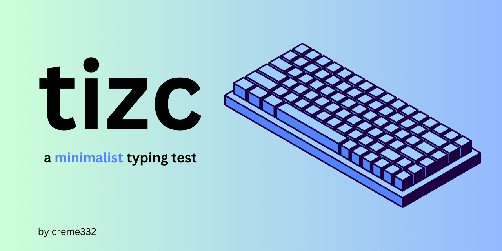
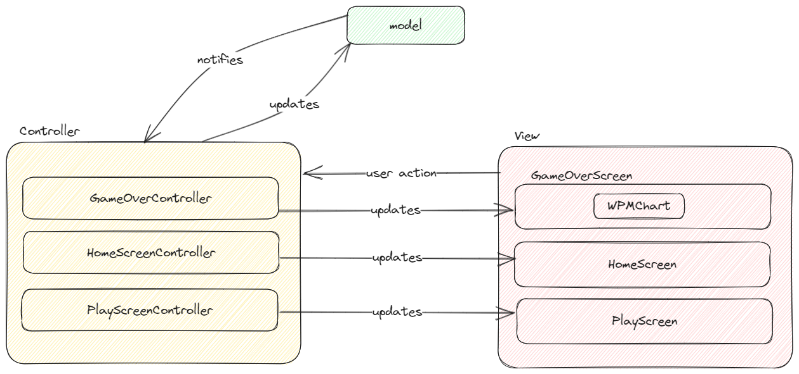

# About
A minimal typing test built with the AWT and Swing graphics library. 



## Features
- Data persistence across sessions
- Customisations
- Detailed statistics with a chart after each test
- Model-View-Controller pattern
- Tested with JUnit
- JavaDoc documentation

## Installation
> 🔴 **Requirement**: You must have Java JDK 11+ installed.

Clone the repository using Git (or download it using any other method):
```bash
git clone git@github.com:creme332/tizc.git
```

Navigate to the root directory of the project:
```bash
cd tizc
```

Run the jar file:
```bash
java -jar tizc.jar
```

Or, run `src/main/java/com/github/creme332/App.java` in an IDE.

> 🔴 **Known bug**: If a white screen is displayed on startup, minimize the window then maximize it again.

## Code coverage
To generate jacoco report:
```bash
mvn jacoco:prepare-agent test install jacoco:report
```

## Usage
Click on the `Play` button and start typing when you are ready. As soon as you make a mistake, the cursor will stop, and you will have to type the correct letter.

> 🟢 **Tip**: When a mistake is made, there is no need to press `Backspace`.

> 🟢 **Tip**: Press `Tab` to restart test at any time. The timer only starts when you start typing.

## To-do
- [ ] Use https://www.formdev.com/flatlaf/
- [ ] Create a release with a .jar file. Use github actions to auto-generate.
- [ ] Track worst keys typed
- [ ] Add time limit
- [ ] Add a settings section
  - [ ] Add customisations (number of words ...)
- [ ] Add data persistence with xstream
  - [ ] Create a dynamic scoreboard
  - [ ] Save highscore
- [ ] [Make UI responsive](https://www.youtube.com/watch?v=ZJsjlucSoXM&ab_channel=SIMPLECODE)
- [ ] Add banner to repository settings

## References
- List of english words in `words.txt`: https://www.ef.com/wwen/english-resources/english-vocabulary/top-1000-words/
- Font from [Google Fonts](https://fonts.google.com/specimen/Poppins)
- Icons from [Flaticon](https://www.flaticon.com/free-icons/)
- [Passive View MVC Pattern](https://martinfowler.com/eaaDev/PassiveScreen.html)

